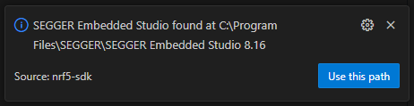
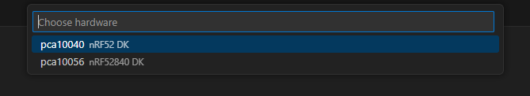
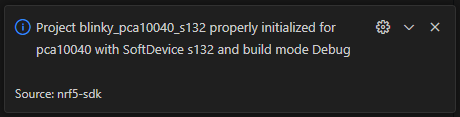
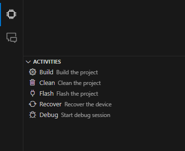
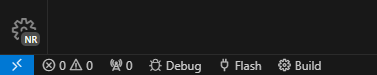
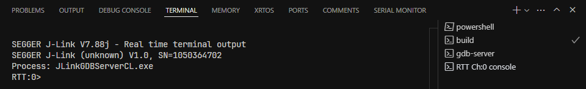
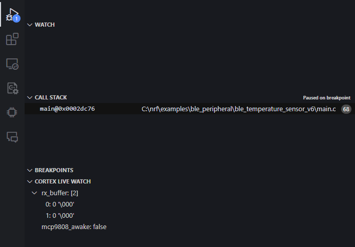

# nRF5 SDK VSCode Extension


This extension provides a set of tools and settings for developing nRF5 SDK applications in Visual Studio Code instead of Segger Embedded Studio.

- **Automatic configuration** of example projects located in the `examples` folder of the nRF5 SDK.
- **IntelliSense** for the nRF5 SDK APIs by reading the `.emProject` files.
- **Choice** of the build target, SoftDevice and mode (debug/release) for each project.
- **Build** and **Flash** the selected project to a connected nRF5 device.
- **Debug** the selected project using the [`Cortex-Debug`](https://github.com/Marus/cortex-debug) extension.

## Requirements

- [nRF5 SDK](https://www.nordicsemi.com/Software-and-Tools/Software/nrf5-vscode)
- [Segger Embedded Studio](https://www.segger.com/downloads/embedded-studio) for building the projects
- [nrfjprog](https://www.segger.com/downloads/jlink) for flashing the code and SoftDevices to the microcontroller
- [J-Link](https://www.segger.com/downloads/jlink) for debugging (Mostly included with Segger Embedded Studio)

> [!WARNING]
> Support for other build tools and flashers are not yet implemented.

## Usage

### Opening a project

Open any project that includes a Segger Embedded Studio project file (`.emProject`) in Visual Studio Code. You will get asked whether the paths to the tools are correct. If not, you can close the prompt and adjust the paths yourself (Also see [Settings](#settings)).



Upon opening the folder, a prompt will occur which will ask you which target, SoftDevice and build mode you want to use (e.g. `pca10040 (nRF52 DK)`, `s132`, `Debug`)



You should get a confirmation message that the project has been configured successfully



### Activities

You can build, clean, flash and debug the project using either
- The provided commands in the command palette (`Ctrl+Shift+P`)
- The activity bar on the left side of the window
- The status bar at the bottom of the window
	




### Debugging

The debug session is a standard [`Cortex-Debug`](https://github.com/Marus/cortex-debug) debug session with [`RTT`](https://wiki.segger.com/RTT) and Cortex Live Watch enabled.

#### RTT (Real-Time Transfer)

The nRF Log module can use RTT to transfer debug messages from and to the device. Any initialized channel can be viewed in the `TERMINAL` tab.




#### Cortex Live Watch

LiveView enables the monitoring of variables during debugging without halting the code. You can add and remove variables to be monitored in the debug view in the activity bar, where you can also see the values.



## Contributions

### Commands

| Command                            | Description                                           |
| ---------------------------------- | ----------------------------------------------------- |
| `nrf5-vscode: Show project info`   | Show information about the currently selected project |
| `nrf5-vscode: Choose project`      | Choose target device and build variant                |
| `nrf5-vscode: Build`               | Build the current project                             |
| `nrf5-vscode: Clean`               | Clean built files of the current project              |
| `nrf5-vscode: Flash`               | Flash the current project                             |
| `nrf5-vscode: Start Debug Session` | Start a debug session in the current project          |

These commands can be used as usual inside the command palette (`Ctrl+Shift+P`) or in the `tasks.json` file.

#### Example

```json
{
	"version": "2.0.0",
	"tasks": [
		{
			"type": "nrf5-vscode",
			"command": "build",
			"problemMatcher": [
				"$gcc"
			],
			"label": "Build Project",
			"group": {
				"kind": "build",
				"isDefault": false
			}
		},
		{
			"type": "nrf5-vscode",
			"command": "flash",
			"dependsOn": "Build Project",
			"label": "Flash Project",
			"group": {
				"kind": "build",
				"isDefault": true
			}
		}
	]
}
```

### Settings

- **`nrf5-vscode.seggerEmbeddedStudioPath`**
  
  Path to the Segger Embedded Studio directory 
  
  _default:_ ``

- **`nrf5-vscode.jLinkPath`**

  Path to the J-Link directory

  _default:_ ``

## Building it yourself

1. Clone the repository
2. Run `npm install`
3. Run `npm run compile`
4. Run `npm run package`
5. Install the `.vsix` file in Visual Studio Code

## Changelog

See the [CHANGELOG.md](CHANGELOG.md) file for more information.

## License

This extension is licensed under a custom license. See the [LICENSE.md](LICENSE.md) file for more information.
